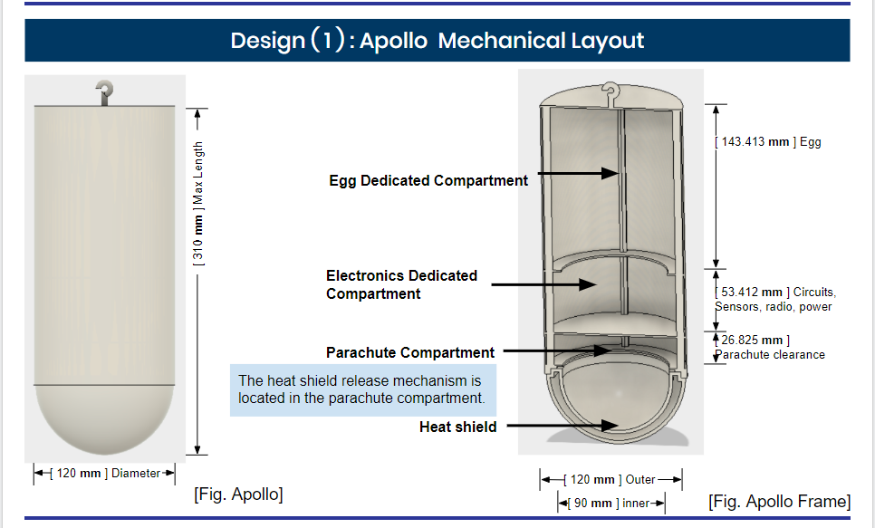
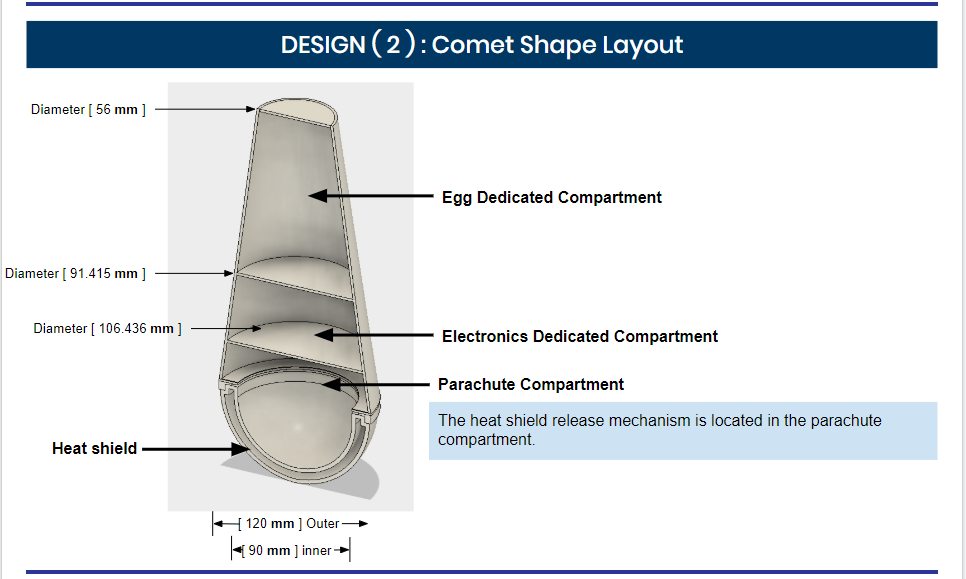

<h1>
  Project description:
</h1>

 
As part of a year-long competition with a group of 7 pre-engineering students, we had a task to research, design, develop, and simulate a space CanSat entering a planetary atmosphere. 

 
A CanSat is an annual student design-build-launch competition for space-related topics. For the CanSat 2018, my team and I needed to simulate a space CanSat entering the planetary atmosphere where the CanSat shall carry a single large hen's egg that must survive all portions of the simulation.

<h1>
 Role:
</h1>

 
The primary role that I had during the research and design phase of the project was as the lead mechanical designer. Our group had 2 main designs, the Apollo and the Comet Layout. A brief description of the design is shown in the images below.

  
  

<h1>
 Milestone:
</h1>

 
A major milestone for the project was the Preliminary Design Review (PDR). During the PDR we needed to defend our ideas as a team to a number of judges via teleconference. This includes defending our ideas about the system (design of our device), electrical (sensors such as air pressure and temperature) and mechanical (release mechanisms, failsafe mechanisms) overview. It also included material considerations and budget.

 
My team and I placed 85 in this international competition on the PDR stage.

