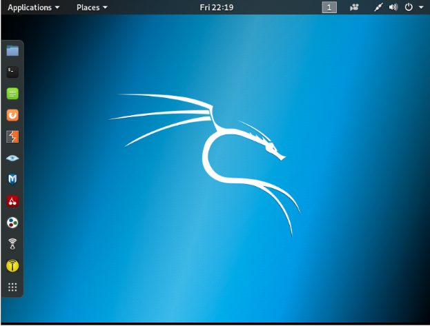
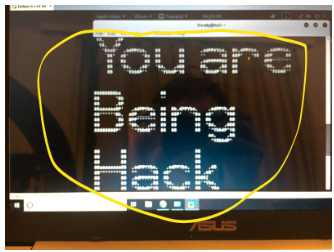
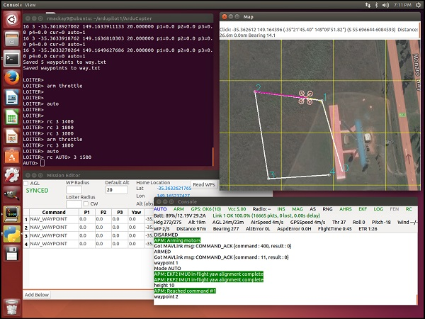

<h1>
  At the begining:
</h1>
My team and I started with mainly on learning the basic of Kali Linux. We were tasked with reading through a pre-prepared book teaching the basics of wireless communications and the various protocols associated with the security of these devices.

  

After I was confident in my Kali Linux skills. I decided to hack my own computer using a raspberry pi and Bluetooth. The process was quite simple, first of all, I needed to install and set up Kali Linux into the raspberry pi. After this, I needed to connect to my IP address and enable Bluetooth on the raspberry pi. Finally, using my own computer I will connect to the Bluetooth from the raspberry pi and my computer screen would display a message, in this case, "You are being hacked." 

  

<h1>
  What is next?
</h1>

Currently, I am self-learning audipilot. Ardupilot is an open-source autopilot software available. it is able to control any vehicle system, being some of them, airplanes, drones, submarines and so on. After learning this, the idea is to be able to intercept the signal of a vehicle system with the hope of either, controlling it or change its directory.

  

